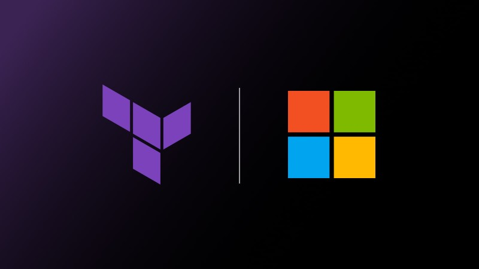

# tf-azure-samples-lib

This repository is your go-to resource for learning and experimenting with Terraform modules for Azure. Explore a variety of examples showcasing how to use Terraform features like objects, dynamic blocks, and more to enhance your infrastructure as code.

## 🔍 What You'll Find Here

- **Object-Oriented Modules**: See how Terraform objects can streamline your code and make it more reusable and organized.
- **Dynamic Blocks**: Learn to manage complex or variable configurations with dynamic blocks.
- **Advanced Features**: Discover other powerful features of Terraform for Azure environments.

## 🎯 Purpose

These samples are designed to give you hands-on experience with Terraform features on Azure. Dive into the modules, customize them to fit your needs, and test them thoroughly. Although these modules are carefully designed, they may still have flaws. It is important to review and validate the configurations to ensure they meet your specific requirements.